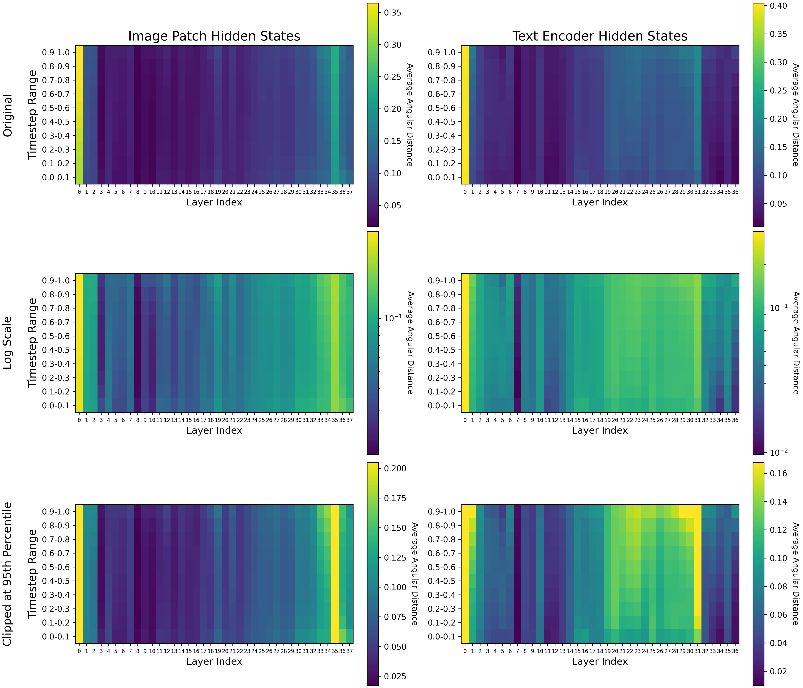
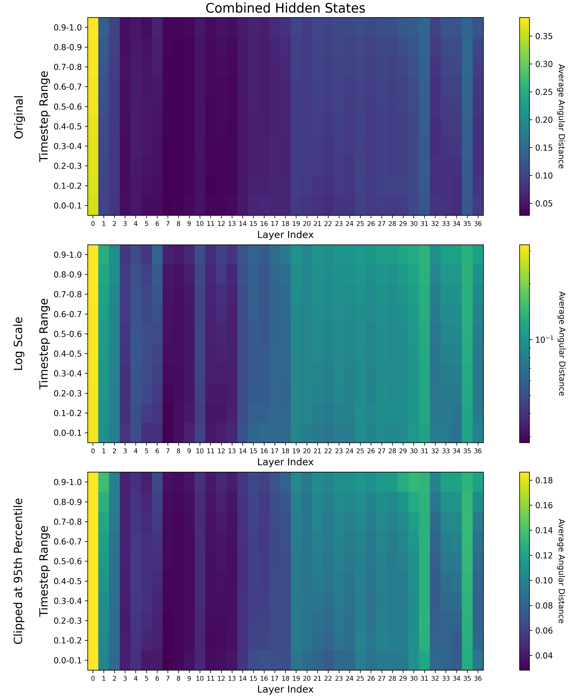
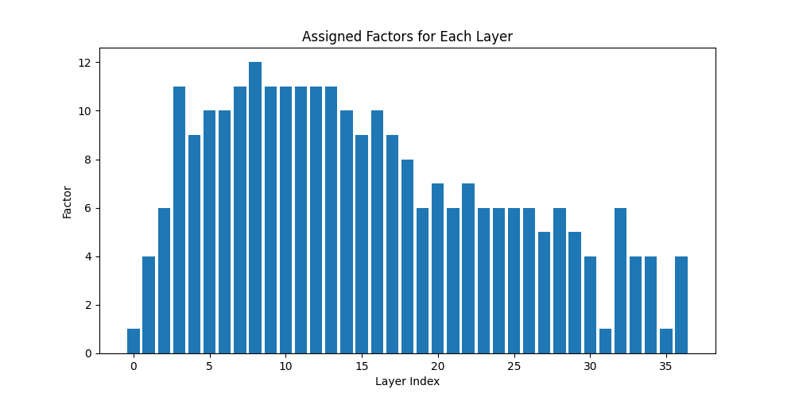

# Layer-wise Analysis of SD3.5 Large
### Layers as Taskwise Mostly Uninterpretable Matrices of Numbers

## Table of Contents

1. [Introduction](#introduction)
2. [Experiment](#experiment)
3. [Results](#results)
   - [There are a number of critical layers](#there-are-a-number-of-critical-layers)
   - [Failing to normalize hides layer-wise contribution](#failing-to-normalize-hides-layer-wise-contribution)
   - [There are task islands and task gradients](#there-are-task-islands-and-task-gradients)
   - [There is just a single layer with almost no apparent contribution](#there-is-just-a-single-layer-with-almost-no-apparent-contribution)
   - [Almost every layer seems to play a role](#almost-every-layer-seems-to-play-a-role)
   - [It's hard to tell the significance of this, but I'm going to YOLO it anyway](#its-hard-to-tell-the-significance-of-this-but-im-going-to-yolo-it-anyway)
4. [Want to talk to me?](#want-to-talk-to-me)
5. [Citation](#citation)

### Introduction

Recently there were a couple of papers looking at the layers in dense neural networks as being [semi-interpretable "painters"](https://arxiv.org/abs/2407.09298), and some even go so far as to suggest that [levels or layers fill in different types of specific visual details into diffusion model hidden states](https://arxiv.org/abs/2403.07500). I try not to go too deep in on these theories because I think they get conspiratorial. When you look at earlier attempts to [explain much simpler vision classification networks](https://distill.pub/2019/activation-atlas/) you notice that many of the simultaneous layer activations don't make sense from a human perspective. Why does one layer equally activate during both `doormat` and `leatherback turtle`? What do `standard poodles` and `paper towels` have in common? While many layers cluster with similar things, many other layers _don't_, and these are tiny networks that should be the most interpretable. Some layers might have more relative significance than others, but I think it's still important to train the entire network even if you don't train each layer equally. This is because diffusion models are among the most uninterpretable types of networks known.

I think there is a consensus now that [the most significant layers are usually in the front and back of dense, layer-symmetric transformers](https://arxiv.org/abs/2403.17887). We know this because you can randomly prune layers in the middle of these models and the quality, at least in LLM metrics terms, doesn't dive very much, and this finding has been replicated across numerous models and papers. I had made some [broken pruned MM-DiT models for AuraFlow](https://huggingface.co/jimmycarter/auraflow-4.8b) way back when, and more recently a version of [FLUX.dev was released with 1/3 of the layers removed](https://huggingface.co/Freepik/flux.1-lite-8B-alpha). I used to be really pro-pruning but recently I'm less sure of that. These models are trained on trillions of tokens or billions of images and would have learned to extract features from all of them. You might be able to restore metric quality, but those are represent an extremely tiny amount of data the network was trained on. We don't understand what those layers did, so how can we understand what we lost?

Diffusion models are different from LLMs. The former is a multi-task network that has to deal with denoising at many timesteps, which is exploited to make generative images later. LLMs only need to take into account all previous tokens, ship the hidden state to a classifier, and then choose the next most probable token. Diffusion models are also conditional on text, further throwing wrenches into interpretations. For [MM-DiT](https://arxiv.org/abs/2403.03206) this may be especially true, since it transforms both image and text embeddings into some kind of jointly aligned state.

With that specified, I'm going to use angular distance to analyze the Stable Diffusion 3.5 Large network and see about how timesteps and conditioning affect output of layers.

```py
# From https://arxiv.org/abs/2403.17887
def compute_angular_distances_consecutive(xs):
    num_layers = len(xs)
    angular_distances = []

    for i in range(num_layers - 1):
        x_i_T = xs[i][:, -1, :]
        x_next_T = xs[i + 1][:, -1, :]

        cos_sim = F.cosine_similarity(x_i_T, x_next_T, dim=-1)
        eps = 1e-7
        cos_sim = cos_sim.clamp(-1 + eps, 1 - eps)
        d = (1 / math.pi) * torch.acos(cos_sim)
        avg_distance = d.mean().item()
        angular_distances.append(avg_distance)

    return angular_distances
```

### Experiment

Because we are looking at a multi-task model, we need to ensure that our layer-wise angular distance relates to the normal task of the model in aggregate. For this I set up a "training" loop with 50,000 random images with 150,000 captions of varying length (3 per image). I ran this for 174,008 steps representing that many (timestep, caption, image crop) pairs. For the image encodings, I did both 1024x1024 random crops along with randomly cropped aspect-ratio bucketing. Then I let it go brrrr on 2x 3090s and instead of doing `loss.backwards()` every round I just ran `compute_angular_distances_consecutive` and then restarted the loop with a new batch. I ran the whole thing with batch size 1, and because normally when we sample images based on timesteps we choose a wide berth of them, I changed the timestep sampling to `torch.rand((bsz,)` so that they are sampled uniformly. Then I made some heatmaps based on this data.

### Results



**Figure 1**. Heatmaps of image patch hidden states compared with heat maps of text encoder hidden states. The 38th layer is excluded from the text encoder hidden states because it is not reused for a subsequent MM-DiT layer. Heat maps are show with the original angular distances on a linear scale, then on a logarithmic scale (`np.log1p(heatmap)`), and with extreme values clipped at the 95th percentile (`np.clip(heatmap, None, np.percentile(heatmap, 95))`).



**Figure 2**. Heatmaps of image patch hidden states naively combined with the heatmap of the text encoder hidden states with `np.add(encoder_heatmap, hidden_heatmap[:, :-1]) / 2.0`.

#### There are a number of critical layers

These layers are 0 (both), 31 (text embedding), and 35 (image embedding). They represent the largest changes to the embeddings with their previous states.

#### Failing to normalize hides layer-wise contribution

The contributions of critical layers are so large that we should consider ignoring them in layer-wise analysis by either showing the heatmaps on a logarithmic scale or clipping the data at a certain percentile. My opinion is that they represent something like alignment to an internal state at the beginning of the network and unpackaging for downstream consumption at the end of the network, so it might be wise to ignore them when trying to make sense of the rest of the network. My theory about middle layers is that they represent feature extraction into embedding space. These features end up being used integratively at the final layers. [Other people seem to think that for LLMs too](https://arxiv.org/abs/2407.09298).

Because the text embeddings are not used specifically for loss in the model, there seems to be no outgoing pressure for them and layerwise contributions peak at layer 31 before the outgoing image layers.

#### There are task islands and task gradients

By "task island" I am referring to the island of layers that appears to specifically handle text embeddings and the island of layers that specifically handles image patches. For text embeddings, these are layers 19-31. For image patches, these are layers 33-37. They are most clear in the "Clipped at 95th Percentile" at the bottom.

This is not to say that some of these layers also don't contribute to both tasks, because there is obviously significant overlap in the initial layers in the "text embedding island". A theory is that these are layers that effectively integrate text and image together.

Task gradients most clearly exist for the text embeddings, and this is expected given that we know that things like [cross attention in earlier models don't do anything in later timesteps](https://arxiv.org/abs/2211.01324). Many of the layers peak in significance at high noise timesteps (represented by timesteps closest to 1.0), and have clear gradients of lower significance as they approach timestep 0.0. Layers 11, 12, 21-24, 26-30, 33, 34, and 36 all show this pattern for the text embeddings. An interesting finding is that the image embeddings also show this pattern for layers 33 and 34, indicating there might be some integrative high noise joint task for both text and image embeddings there. This is right before critical layer 35 for the image embedding layers.

Another thing noticed in the gradients is apparent multi-task specialization. For image embeddings, layers 2, 13, 18, 19, and 36 show high contributions at both the high noise and low noise timestep extrema. This might indicate that these layers have learned to make different, dissimilar task specializations.

#### There is just a single layer with almost no apparent contribution

This is layer 7. It shows very little residual contribution for both the text and image task. This isn't to say it's useless -- it might be specialized to some type of text conditioning that was not included in my testing dataset.

#### Almost every layer seems to play a role

It can be hard to see that these roles exist unless you do logarithmic analysis or clipping, because the critical layers that seem to "convert" the data in and out of embedding space have such high angular distance. We don't know exactly what these roles might be, and we don't have good enough metrics for text-to-image to even be able to tell what was damaged when skipping or removing them. Let's consider a theoretical layer where one portion deals with the task of adding rainbow colored hair to a character based on a prompt (again, not saying this exists, it's a thought experiment because these models are more or less black boxes). Coming in, the image patches might have say, purple or green hair for the character, and going out those patches, a tiny amount of the overall image, might be rainbow. Now we have what is a very tiny difference in angular distance but it doesn't mean that the layer hasn't learned an important role. Angular distance is just one metric here and the text-to-image task involves a lot of nuance expressed through millions of objects and textures.

#### It's hard to tell the significance of this, but I'm going to YOLO it anyway

Normally this is the point in a paper where you ablate or rearrange the layers, show that the model is damaged, and try to make some interpretations about that. I don't really know if that's meaningful, especially when it comes down to something like text-to-image where the output is diverse. You could probably use the above knowledge to surmise that some layers have more to do with denoising at some timesteps rather than others, and show that the quality of predictions at those timesteps is degraded with ablation. That would be a cool study!

Another study you could do would be to see how differently weighting these layers affect parameter-efficient fine-tuning like LoKr. My guess is that since we don't know exactly what each layer is doing, and because it takes a long time to train these models, you might end up with a lot of difficult to interpret data from that. If your model learned to make a character in two LoKrs, and the character is wearing their hat in the one LoKr with a different parameter weighting but not the other, how do you interpret that? Maybe someone can come up with a clever experiment here.

I don't have a lot of computational power to motor through this stuff and no one is paying me to do so, so I'm going to use this knowledge to weight layers in a big LoKr and try and have some fun training that. To make the configuration for that I took the contributions clipped at a 90th percentile, averaged across the timestep layer, and then normalized and took the inverse and bashed it into a LoKr configuration for [SimpleTuner](https://github.com/bghira/SimpleTuner). Because there is no direct contribution of the text embedding to the loss in this model, I gave it a 1/3 weighting and the image embedding portion of the model a 2/3 weighting.

```py
TASK_WEIGHT_IMAGE = (2/3)
TASK_WEIGHT_TEXT = (1/3)
encoder_heatmap_clipped_90 = np.clip(encoder_heatmap, None, np.percentile(encoder_heatmap, 90)) * TASK_WEIGHT_TEXT
hidden_heatmap_clipped_90 = np.clip(hidden_heatmap, None, np.percentile(hidden_heatmap, 90)) * TASK_WEIGHT_IMAGE
clipped_combined_heatmap_90 = np.add(encoder_heatmap_clipped_90, hidden_heatmap_clipped_90[:, :-1]) / 2.0
per_layer_averages = np.mean(clipped_combined_heatmap_90, axis=0)
normalized_contributions = (per_layer_averages - per_layer_averages.min()) / (per_layer_averages.max() - per_layer_averages.min())
inverted_normalized_contributions = 1 - normalized_contributions
```



Figure 3. The weighted LoKr factor configuration, designed to give more parameters to portions of the model that might or might not make more significant contributions based on the assumption that angular difference has some important meaning. The weighted LoKr configuration for SimpleTuner is given in this repo as `peft_config.json`, and the notebook used to produce these images and configurations is given as `heatmap.ipynb`. The data is available in `sd3_hidden_state_similarity.jsonl.gz`.

### Want to talk to me?

Come to the [Terminus Research Discord from the link on this page](https://huggingface.co/terminusresearch).

### Citation

```
@misc{SD3.5Layers,
  author = {James Carter},
  title = {Layer-wise Analysis of SD3.5 Large},
  year = {2024},
  publisher = {Github},
  journal = {Github repository},
  howpublished = {\url{https://Github.com/AmericanPresidentJimmyCarter/sd3.5-layer-wise-analysis}},
}
```